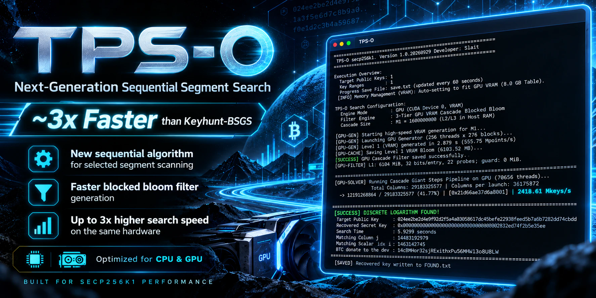

<p align="center">
  
</p>

<p align="center">
  <strong>High-performance deterministic interval search for secp256k1 on CPU and CUDA GPUs.</strong>
</p>

<p align="center">
  <a href="README_RU.md">🇷🇺 Русская версия</a>
</p>

<p align="center">
  
  
  
  
  
  
</p>

---

# TPS-O

**TPS-O** is a high-performance application for deterministic search inside a **known secp256k1 private-key interval**. It supports CPU, single-GPU and multi-GPU execution and includes a memory-efficient **3-tier Blocked Bloom cascade** designed for large baby-step sets.

The current implementation is focused on three practical advantages:

- a new deterministic **sequential segment-cover algorithm**;
- faster **Blocked Bloom filter generation**;
- up to **~3× higher search throughput than Keyhunt-BSGS on the same hardware** in the author's matched tests.

> [!IMPORTANT]
> The `~3×` figure is an implementation benchmark result, not a universal constant. Performance depends on GPU/CPU, interval width, filter size, cache state, driver/runtime versions and tuning parameters.

> [!NOTE]
> TPS-O is distributed as a **compiled executable only**. Source code is not included in the public distribution.

## TPS-O algorithm

For a target point

$$Q=kP, \qquad k=L+t, \qquad 0\le t<w,$$

TPS-O shifts the problem to

$$R=Q-LP=tP.$$

For a baby-step count `a`, define

$$d=2a+1,$$

and for giant column `j`:

$$\beta_j=a+1+jd,$$

$$T_j=R-\beta_jP.$$

A match with `0`, `+S_i` or `-S_i` resolves the corresponding offset inside the column. Logically, column `j` covers the complete consecutive block

$$[jd+1,(j+1)d].$$

Adjacent columns therefore cover the selected interval **deterministically and without intended gaps**. CPU and GPU backends may process columns in batches or stripes, but the logical interval coverage is unchanged.

## Main features

| Feature | Description |
|---|---|
| **Sequential interval coverage** | Deterministic coverage of the selected key segment. |
| **CPU mode** | Multithreaded host execution with optimized arithmetic paths. |
| **CUDA GPU mode** | High-throughput GPU search with VRAM-resident filtering. |
| **Multi-GPU** | Use all detected GPUs or an explicit device list. |
| **Classic hash filter** | Conventional baby-step hash table for smaller configurations. |
| **3-tier Blocked Bloom cascade** | L1 → L2 → exact L3 resolver for large configurations. |
| **Persistent filters** | Filters can be generated once, saved and reused. |
| **Checkpointing** | Search progress can be saved periodically and resumed through range files. |
| **Multiple targets** | Load many compressed public keys from a file. |
| **Multiple ranges** | Load many key ranges from a file. |
| **Exact final verification** | Every recovered candidate is verified against the target public key. |
| **Benchmark / profiling controls** | Built-in benchmark mode and low-level CPU/GPU tuning variables. |

## Filter types

TPS-O supports two filter engines. If `-filter-type` is omitted, the application selects the mode automatically.

### `hash` — classic hash table

Best suited to smaller baby-step sets.

```powershell
.\TPS-O.exe -mode GPU -filter-type hash -Q <PUBKEY> -r <START:END>
```

Key points:

- compact classic baby-step table;
- can be cached and reused;
- baby-step index is limited to **4,294,967,295** entries;
- use `cascade` for larger configurations.

Aliases: `hash`, `table`.

### `cascade` — 3-tier Blocked Bloom

Recommended for large searches.

```text
L1 Blocked Bloom  →  L2 Blocked Bloom  →  L3 exact table
```

- **CPU mode:** L1/L2/L3 are stored in system RAM;
- **GPU mode:** L1 is placed in GPU VRAM, while L2/L3 are resolved on the host;
- generated cascade filters can be saved and reused;
- supports baby-step counts beyond the classic 32-bit table limit.

Aliases: `cascade`, `bloom`.

TPS-O may auto-select the cascade for large baby-step configurations or when a matching cascade cache is detected.

---

# Quick Start

## 1. Show help

```powershell
.\TPS-O.exe --help
```

> [!TIP]
> Running the current binary **without arguments** starts its automated GPU benchmark. Use explicit arguments for a normal search.

## 2. Basic GPU search

```powershell
.\TPS-O.exe `
  -mode GPU `
  -filter-type cascade `
  -gpu 0 `
  -Q 02<compressed-public-key> `
  -r 1000000000000000:1fffffffffffffff
```

The `-r` / `-range` endpoints are hexadecimal and **inclusive**.

## 3. Basic CPU search

```powershell
.\TPS-O.exe `
  -mode CPU `
  -t 20 `
  -filter-type cascade `
  -Q 02<compressed-public-key> `
  -r 1000000000000000:1fffffffffffffff
```

Legacy CPU alias:

```powershell
.\TPS-O.exe --cpu -t 20 -Q 02<compressed-public-key> -r 1000:ffff
```

## 4. Use `L + width` instead of `start:end`

```powershell
.\TPS-O.exe -mode GPU -Q 03<compressed-public-key> -L 1000000000000000 -w 0x100000000
```

This searches the interval:

```text
[L, L + w - 1]
```

`-w` accepts decimal or `0x...` hexadecimal notation.

## 5. Use multiple GPUs

All detected CUDA GPUs:

```powershell
.\TPS-O.exe -mode GPU -gpu all -filter-type cascade -Q 02<compressed-public-key> -r 1000:ffffffff
```

Specific GPUs:

```powershell
.\TPS-O.exe -mode GPU -gpu 0,1,2 -filter-type cascade -Q 02<compressed-public-key> -r 1000:ffffffff
```

`-gpus` is an alias of `-gpu`.

## 6. Search multiple ranges

`ranges.txt`:

```text
# Hex ranges, inclusive
1000000000000000:1fffffffffffffff
2000000000000000:2fffffffffffffff
// comments are allowed
3000000000000000 3fffffffffffffff
```

Run:

```powershell
.\TPS-O.exe -mode GPU -Q 02<compressed-public-key> -rangefile ranges.txt
```

`start:end`, `start end` and `start<TAB>end` are accepted.

## 7. Search multiple public keys

`pubkeys.txt`:

```text
# One compressed secp256k1 public key per line
02...
03...
```

Run:

```powershell
.\TPS-O.exe -mode GPU -pubfile pubkeys.txt -rangefile ranges.txt
```

Blank lines plus `#` and `//` comments are ignored.

## 8. Save and resume progress

Custom checkpoint file:

```powershell
.\TPS-O.exe -mode GPU -Q 02<compressed-public-key> -r 1000:ffffffff -save my_progress.txt
```

The checkpoint is written in range-file-compatible form and can later be supplied as a range file:

```powershell
.\TPS-O.exe -mode GPU -Q 02<compressed-public-key> -rangefile my_progress.txt
```

Disable progress saving:

```powershell
.\TPS-O.exe -mode GPU -Q 02<compressed-public-key> -r 1000:ffffffff --no-save
```

The following forms also disable it:

```text
-save none
-save off
-save 0
```

## 9. Reuse a filter

Automatic load/save by name:

```powershell
.\TPS-O.exe -filter-type cascade -f my_filter -Q 02<compressed-public-key> -r 1000:ffffffff
```

Require an existing filter and refuse regeneration if it does not match:

```powershell
.\TPS-O.exe -filter-type cascade --load-filter my_filter -Q 02<compressed-public-key> -r 1000:ffffffff
```

Force saving a generated filter:

```powershell
.\TPS-O.exe -filter-type cascade --save-filter my_filter -Q 02<compressed-public-key> -r 1000:ffffffff
```

Disable filter disk cache:

```powershell
.\TPS-O.exe --no-cache -Q 02<compressed-public-key> -r 1000:ffffffff
```

## 10. Force baby-step size / memory target

Exact baby-step count:

```powershell
.\TPS-O.exe -filter-type cascade -a 1.6G -Q 02<compressed-public-key> -r 1000:ffffffff
```

Memory/entry target:

```powershell
.\TPS-O.exe -filter-type cascade -m 32G -Q 02<compressed-public-key> -r 1000:ffffffff
```

For `-a`, suffixes `K/M/G/T` scale the **entry count** by powers of 1024. For `-m`, a suffixed value is interpreted as a memory size and converted to the internal table-entry budget.

## 11. Verification with a known private key

Useful for testing and benchmarking:

```powershell
.\TPS-O.exe -mode GPU -priv <KNOWN_PRIVATE_KEY_HEX> -r 1000:ffffffff
```

If `-Q` is also supplied, TPS-O verifies that the known private key corresponds to that public key.

Focused test window:

```powershell
.\TPS-O.exe -mode GPU -priv <KNOWN_PRIVATE_KEY_HEX> -r 1000:ffffffff --test-window 1048576
```

`--test-window` is a diagnostic/testing option and requires a known private key to be useful.

## 12. Public cryptographic puzzle search

For a public puzzle whose rules explicitly provide a target key and allowed interval:

```powershell
.\TPS-O.exe `
  -mode GPU `
  -filter-type cascade `
  -gpu all `
  -Q <PUZZLE_COMPRESSED_PUBLIC_KEY> `
  -r <PUZZLE_START_HEX>:<PUZZLE_END_HEX>
```

TPS-O does not discover the puzzle interval automatically; use the interval published by the puzzle organizer.

## 13. Benchmark mode

```powershell
.\TPS-O.exe --bench
```

CPU benchmark:

```powershell
.\TPS-O.exe --bench --cpu -t 20
```

Limit giant steps for controlled benchmark runs:

```powershell
.\TPS-O.exe -Q 02<compressed-public-key> -r 1000:ffffffff --max-steps 1000000
```

Alias:

```text
--max-giant-steps
```

> [!WARNING]
> `--max-steps` intentionally truncates the search. A truncated run is **not** a complete search of the configured interval.

## Complete CLI reference

| Option | Meaning |
|---|---|
| `-mode <GPU\|CPU>` | Select execution backend. Default: GPU. |
| `--cpu` | Legacy alias for `-mode CPU`. |
| `-filter-type <cascade\|hash>` | Select filter engine. `bloom` aliases `cascade`; `table` aliases `hash`. Omit for automatic selection. |
| `--filter-type <...>` | Alias of `-filter-type`. |
| `-range <start:end>` | Add one inclusive hexadecimal range. |
| `-r <start:end>` | Alias of `-range`. |
| `-rangefile <file>` | Load ranges from a file. |
| `--rangefile <file>` | Alias of `-rangefile`. |
| `-L <hex>` | Lower bound used when no explicit range/rangefile is supplied. Default: `0`. |
| `-w <dec\|0xhex>` | Width used with `-L`. Default: `65536` (`0x10000`). |
| `-Q <compressed_pubkey>` | Add one target compressed public key (`02...` / `03...`). |
| `-pub <compressed_pubkey>` | Alias of `-Q`. |
| `-pubfile <file>` | Load target public keys from a file. |
| `--pubfile <file>` | Alias of `-pubfile`. |
| `-priv <hex>` | Known private key for verification/testing. |
| `-save <file>` | Checkpoint path. Default: `save.txt`. |
| `--save <file>` | Alias of `-save`. |
| `--no-save` | Disable progress checkpoints. |
| `-a <count>` | Force exact baby-step count. Supports `K/M/G/T` suffixes. |
| `-m <size/count>` | Set table memory/entry budget. Suffixes `K/M/G/T` are supported. |
| `-size <size/count>` | Alias of `-m`. |
| `-f <name>` | Named filter cache: load if present, save if generated. |
| `--filter <name>` | Alias of `-f`. |
| `--load-filter <name>` | Require loading an existing filter. |
| `--save-filter <name>` | Force saving the generated filter. |
| `--no-cache` | Disable filter loading/saving from disk. |
| `-t <num>` | Number of CPU threads. |
| `--threads <num>` | Alias of `-t`. |
| `-gpu <all\|id\|0,1,2>` | GPU selection. If omitted in GPU mode, all detected GPUs are used. |
| `-gpus <...>` | Alias of `-gpu`. |
| `--test-window <size>` | Diagnostic window for a run with a known private key. Decimal or `0x...`. |
| `--max-steps <num>` | Limit giant columns for benchmarking/testing. |
| `--max-giant-steps <num>` | Alias of `--max-steps`. |
| `--bench` | Run the built-in automated benchmark. |
| `--help` | Show command-line help. |

> [!NOTE]
> If no public key, public-key file, or known private key is supplied, the current binary generates a synthetic target inside the first configured range for testing.

---

# Fine tuning

TPS-O exposes optional environment variables for advanced tuning. Defaults are generally the recommended starting point.

### GPU tuning

| Variable | Values / default | Effect |
|---|---|---|
| `TPS_GPU_BLOCKS_PER_SM` | `1..16`, default `6` | CUDA grid size per streaming multiprocessor. |
| `TPS_GPU_PROFILE` | set / unset | Enables GPU timing/profile output when present. |
| `TPS_GPU_LEGACY` | set / unset | Uses the legacy GPU path when present. Leave **unset** for the newer affine path. |
| `TPS_GPU_GUARD` | `0`, `1`, unset | `0` disables guard, `1` forces it, unset uses automatic behavior for very large searches. |
| `TPS_GPU_HOST_SIMD` | `0` or unset | `0` disables SIMD in the host-side GPU candidate resolver. |

Example:

```powershell
$env:TPS_GPU_BLOCKS_PER_SM="8"
$env:TPS_GPU_PROFILE="1"
.\TPS-O.exe -mode GPU -gpu 0 -filter-type cascade -Q 02<compressed-public-key> -r 1000:ffffffff
```

### CPU tuning

| Variable | Values / default | Effect |
|---|---|---|
| `TPS_CPU_SIMD` | default on; `0` = off | Enables/disables CPU SIMD paths. |
| `TPS_CPU_BATCH` | `256`, `512`, `1024`; default `1024` | CPU processing batch size. |
| `TPS_CPU_WORK` | `16384`, `65536`, `262144`; default `65536` | CPU work chunk size. |
| `TPS_CPU_PREFETCH` | `64`, `128`, `256`, `512`; default `256` | Blocked Bloom prefetch window. |
| `TPS_CPU_EARLY_BITS` | `1`, `2`, `4`; default `2` | Early Bloom probe rounds. |
| `TPS_CPU_RESOLVER_SIMD` | `1` or unset | `1` lowers the SIMD resolver threshold. |
| `TPS_CPU_RESOLVER_QUEUE` | `4` or other; default `4` | Candidate resolver queue depth (`4` or `1`). |
| `TPS_CPU_PAIR_OUTPUT` | `legacy` or unset | Selects legacy pair-output path; default is the newer direct path. |
| `TPS_CPU_LARGE_PAGES` | default on; `0` = off | Attempts Windows large-page allocations and falls back normally if unavailable. |
| `TPS_CPU_FILTER_ARENA` | default on; `0` = off | Controls arena-based filter loading. |
| `TPS_CPU_PROFILE` | set / unset | Enables CPU timing/profile output when present. |

### Checkpoint interval

| Variable | Default | Effect |
|---|---:|---|
| `TPS_SAVE_INTERVAL_SEC` | `60` | Positive number of seconds between checkpoint updates. |

Example:

```powershell
$env:TPS_SAVE_INTERVAL_SEC="15"
.\TPS-O.exe -mode GPU -Q 02<compressed-public-key> -r 1000:ffffffff -save progress.txt
```

To return to default behavior in PowerShell, remove the variable:

```powershell
Remove-Item Env:TPS_GPU_PROFILE -ErrorAction SilentlyContinue
Remove-Item Env:TPS_GPU_BLOCKS_PER_SM -ErrorAction SilentlyContinue
```

---

# Interface example

<p align="center">
  
</p>

Typical output shows:

- selected CPU/GPU backend;
- key/range count;
- chosen `a`, `d` and giant-step count;
- filter generation/loading status;
- current progress and throughput;
- exact candidate verification;
- the recovered scalar when a valid match is found.

---

# Correctness model

TPS-O separates **logical interval coverage** from **implementation filtering**.

1. The TPS-O construction divides the configured interval into adjacent deterministic giant-column blocks.
2. Hash/Bloom structures are used to reject non-candidates efficiently; they do not replace the mathematical interval definition.
3. A surviving candidate is resolved to a scalar and then subjected to an **exact elliptic-curve verification** against the requested public key.
4. The recovered scalar must also belong to the configured interval.
5. Checkpointing changes where a later run restarts; it does not change the intended search relation.

A complete run is expected to report a match when the target scalar is inside the searched interval and the required filter/cache data and hardware execution are correct.

Completeness does **not** apply when the user intentionally truncates execution with `--max-steps`, searches the wrong interval, supplies an unrelated public key, or uses corrupted/incompatible data.

---

# Limitations

- TPS-O is an **interval-search application**. It does not make unrestricted 256-bit secp256k1 search practical.
- The correct search interval must come from external information or the rules of a public puzzle/test.
- Public-key input is expected in compressed secp256k1 form (`02...` / `03...`).
- GPU mode requires a compatible NVIDIA CUDA GPU and driver supported by the distributed binary.
- CPU/GPU performance depends strongly on hardware, memory bandwidth, filter size and interval width.
- Large filters may require substantial VRAM, RAM and disk space.
- The classic hash mode has a 32-bit baby-step index limit; use the cascade for larger tables.
- Cached filters must correspond to the chosen configuration. Forced `--load-filter` rejects an incompatible/missing filter rather than silently rebuilding it.
- Search-rate comparisons should be made with matching ranges, filter states and hardware conditions.
- This public distribution is **binary-only**; modification of the executable is not permitted by the project license.

---

# Responsible use

TPS-O is intended for lawful and authorized work, including:

- cryptographic research and education;
- your own keys and systems;
- authorized recovery where you have permission to recover the key;
- controlled benchmarks and test vectors;
- CTFs and security challenges where key search is explicitly permitted;
- **public Bitcoin/secp256k1 puzzles and other public cryptographic puzzles that are intentionally published to be solved**, using the organizer's published target and range.

Do **not** use TPS-O to search for or recover private keys belonging to third parties without authorization, to access wallets/accounts you do not own or have permission to test, or for any activity prohibited by applicable law or the rules of the relevant service/puzzle.

> [!CAUTION]
> The software provides no guarantee that a target is inside a supplied range, that a puzzle reward is still available, or that a search will produce a financial result. You are responsible for validating puzzle rules, ownership/authorization, local law, hardware safety, power cost and all consequences of use.

---

# License

**TPS-O Binary License 1.0** — a custom proprietary/freeware-style binary license designed for this distribution model.

In short:

- ✅ you may **use** the original executable;
- ✅ you may **copy, archive and redistribute the original unmodified executable**;
- ✅ you may use it for lawful research, testing, recovery and public puzzle solving;
- ❌ you may not modify, patch or create altered versions of the executable;
- ❌ you may not remove authorship/license notices or present the application as your own;
- ❌ reverse engineering/decompilation/disassembly is prohibited except where such a restriction is unenforceable under applicable law;
- ❌ resale/sublicensing of the application itself requires the author's written permission;
- ⚠️ the software is provided **“AS IS”**, without warranty, and use is entirely at your own risk.

See [`LICENSE`](LICENSE) for the full terms.

reviewed by a qualified lawyer.
