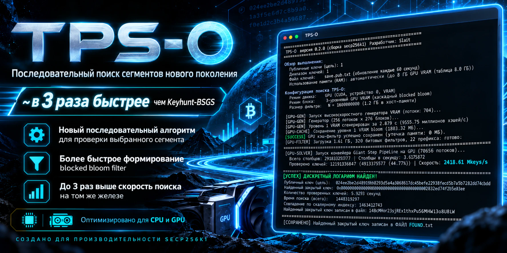
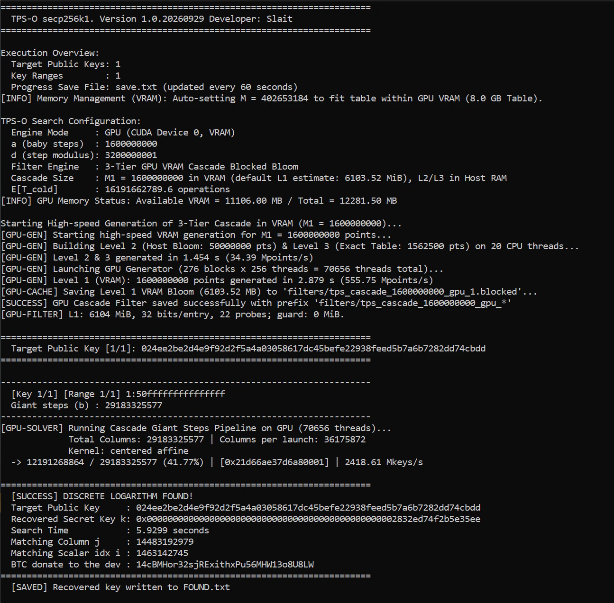

<p align="center">
  
</p>

<p align="center">
  <strong>Высокопроизводительный детерминированный интервальный поиск secp256k1 на CPU и CUDA GPU.</strong>
</p>

<p align="center">
  <a href="README.md">🇬🇧 English version</a>
</p>

<p align="center">
  
  
  
  
  
  
</p>

---

# TPS-O

**TPS-O** — высокопроизводительное приложение для детерминированного поиска внутри **известного интервала приватных ключей secp256k1**. Программа поддерживает CPU, одну GPU и несколько GPU, а для больших baby-step наборов использует экономичный по памяти **трёхуровневый каскад Blocked Bloom**.

Текущая реализация ориентирована на три практических преимущества:

- новый детерминированный алгоритм **последовательного покрытия выбранного сегмента**;
- более быстрое **формирование Blocked Bloom фильтров**;
- до **~3× более высокая скорость поиска относительно Keyhunt-BSGS на том же оборудовании** в сопоставимых тестах автора.

> [!IMPORTANT]
> Значение `~3×` является результатом производительности конкретной реализации, а не универсальной константой. Скорость зависит от CPU/GPU, ширины диапазона, размера фильтра, наличия кэша, версий драйвера/runtime и параметров настройки.

> [!NOTE]
> TPS-O распространяется **только в виде готового исполняемого файла**. Исходный код в публичную версию не входит.

## Алгоритм TPS-O

Для целевой точки

$$Q=kP, \qquad k=L+t, \qquad 0\le t<w$$

TPS-O выполняет сдвиг:

$$R=Q-LP=tP.$$

При количестве baby-step `a` определяется

$$d=2a+1,$$

а для giant-колонки `j`:

$$\beta_j=a+1+jd,$$

$$T_j=R-\beta_jP.$$

Совпадение с `0`, `+S_i` или `-S_i` определяет соответствующее смещение внутри колонки. Логически колонка `j` полностью покрывает последовательный блок

$$[jd+1,(j+1)d].$$

Соседние колонки примыкают друг к другу, поэтому выбранный интервал покрывается **детерминированно и без предполагаемых пропусков**. CPU/GPU backend может обрабатывать колонки пакетами или полосами, но математическое покрытие интервала от этого не меняется.

## Основные возможности

| Возможность | Описание |
|---|---|
| **Последовательное покрытие интервала** | Детерминированная проверка выбранного сегмента ключей. |
| **CPU** | Многопоточный поиск на процессоре с оптимизированными арифметическими путями. |
| **CUDA GPU** | Высокопроизводительный поиск на GPU с фильтрацией в VRAM. |
| **Multi-GPU** | Работа на всех обнаруженных GPU или выбранном списке устройств. |
| **Classic hash** | Классическая baby-step hash-таблица для небольших конфигураций. |
| **3-tier Blocked Bloom cascade** | L1 → L2 → точный L3 resolver для больших конфигураций. |
| **Кэширование фильтров** | Фильтр можно сформировать один раз, сохранить и использовать повторно. |
| **Checkpoint** | Периодическое сохранение прогресса с возможностью продолжения через range-файл. |
| **Несколько целей** | Загрузка множества сжатых публичных ключей из файла. |
| **Несколько диапазонов** | Загрузка множества диапазонов из файла. |
| **Точная финальная проверка** | Каждый найденный кандидат проверяется по целевому публичному ключу. |
| **Benchmark / profiling** | Встроенный benchmark и низкоуровневые параметры CPU/GPU. |

## Типы фильтров

TPS-O поддерживает два типа фильтров. Если `-filter-type` не указан, программа выбирает подходящий режим автоматически.

### `hash` — классическая hash-таблица

Подходит прежде всего для небольших baby-step наборов.

```powershell
.\TPS-O.exe -mode GPU -filter-type hash -Q <PUBKEY> -r <START:END>
```

Особенности:

- компактная классическая baby-step таблица;
- может сохраняться на диск и использоваться повторно;
- индекс baby-step ограничен **4 294 967 295** элементами;
- для больших конфигураций используйте `cascade`.

Псевдонимы: `hash`, `table`.

### `cascade` — трёхуровневый Blocked Bloom

Рекомендуемый вариант для больших поисков.

```text
L1 Blocked Bloom  →  L2 Blocked Bloom  →  L3 точная таблица
```

- **CPU:** L1/L2/L3 находятся в системной RAM;
- **GPU:** L1 размещается в VRAM, L2/L3 разрешаются на стороне CPU;
- сформированный cascade можно сохранить и использовать повторно;
- поддерживаются baby-step размеры больше 32-битного лимита классической таблицы.

Псевдонимы: `cascade`, `bloom`.

TPS-O может автоматически выбрать cascade при большой baby-step конфигурации либо при обнаружении подходящего cascade-кэша.

---

# Быстрый старт

## 1. Справка

```powershell
.\TPS-O.exe --help
```

> [!TIP]
> Запуск текущей версии **без параметров** запускает автоматический GPU benchmark. Для обычного поиска указывайте параметры явно.

## 2. Обычный поиск на GPU

```powershell
.\TPS-O.exe `
  -mode GPU `
  -filter-type cascade `
  -gpu 0 `
  -Q 02<compressed-public-key> `
  -r 1000000000000000:1fffffffffffffff
```

Границы `-r` / `-range` задаются в hex и являются **включительными**.

## 3. Поиск на CPU

```powershell
.\TPS-O.exe `
  -mode CPU `
  -t 20 `
  -filter-type cascade `
  -Q 02<compressed-public-key> `
  -r 1000000000000000:1fffffffffffffff
```

Старый короткий псевдоним CPU-режима:

```powershell
.\TPS-O.exe --cpu -t 20 -Q 02<compressed-public-key> -r 1000:ffff
```

## 4. Интервал в форме `L + width`

```powershell
.\TPS-O.exe -mode GPU -Q 03<compressed-public-key> -L 1000000000000000 -w 0x100000000
```

Будет проверяться интервал:

```text
[L, L + w - 1]
```

`-w` принимает десятичное число либо hex в форме `0x...`.

## 5. Несколько GPU

Все обнаруженные CUDA GPU:

```powershell
.\TPS-O.exe -mode GPU -gpu all -filter-type cascade -Q 02<compressed-public-key> -r 1000:ffffffff
```

Выбранные GPU:

```powershell
.\TPS-O.exe -mode GPU -gpu 0,1,2 -filter-type cascade -Q 02<compressed-public-key> -r 1000:ffffffff
```

`-gpus` является псевдонимом `-gpu`.

## 6. Несколько диапазонов

Файл `ranges.txt`:

```text
# Hex-диапазоны, обе границы включены
1000000000000000:1fffffffffffffff
2000000000000000:2fffffffffffffff
// комментарии разрешены
3000000000000000 3fffffffffffffff
```

Запуск:

```powershell
.\TPS-O.exe -mode GPU -Q 02<compressed-public-key> -rangefile ranges.txt
```

Поддерживаются формы `start:end`, `start end` и `start<TAB>end`.

## 7. Несколько публичных ключей

Файл `pubkeys.txt`:

```text
# Один сжатый secp256k1 public key на строку
02...
03...
```

Запуск:

```powershell
.\TPS-O.exe -mode GPU -pubfile pubkeys.txt -rangefile ranges.txt
```

Пустые строки и комментарии `#` / `//` игнорируются.

## 8. Сохранение и продолжение поиска

Свой checkpoint-файл:

```powershell
.\TPS-O.exe -mode GPU -Q 02<compressed-public-key> -r 1000:ffffffff -save my_progress.txt
```

Checkpoint записывается в формате, совместимом с `rangefile`, поэтому его можно использовать для продолжения:

```powershell
.\TPS-O.exe -mode GPU -Q 02<compressed-public-key> -rangefile my_progress.txt
```

Отключить сохранение прогресса:

```powershell
.\TPS-O.exe -mode GPU -Q 02<compressed-public-key> -r 1000:ffffffff --no-save
```

То же действие выполняют:

```text
-save none
-save off
-save 0
```

## 9. Повторное использование фильтра

Автоматически загрузить существующий фильтр либо сохранить вновь созданный:

```powershell
.\TPS-O.exe -filter-type cascade -f my_filter -Q 02<compressed-public-key> -r 1000:ffffffff
```

Требовать существующий фильтр и не генерировать новый при несовпадении:

```powershell
.\TPS-O.exe -filter-type cascade --load-filter my_filter -Q 02<compressed-public-key> -r 1000:ffffffff
```

Принудительно сохранить сформированный фильтр:

```powershell
.\TPS-O.exe -filter-type cascade --save-filter my_filter -Q 02<compressed-public-key> -r 1000:ffffffff
```

Полностью отключить дисковый кэш фильтров:

```powershell
.\TPS-O.exe --no-cache -Q 02<compressed-public-key> -r 1000:ffffffff
```

## 10. Принудительный размер baby-step / лимит памяти

Точное значение `a`:

```powershell
.\TPS-O.exe -filter-type cascade -a 1.6G -Q 02<compressed-public-key> -r 1000:ffffffff
```

Лимит памяти/числа элементов:

```powershell
.\TPS-O.exe -filter-type cascade -m 32G -Q 02<compressed-public-key> -r 1000:ffffffff
```

Для `-a` суффиксы `K/M/G/T` масштабируют **число элементов** степенями 1024. Для `-m` значение с суффиксом трактуется как объём памяти и преобразуется во внутренний лимит записей.

## 11. Проверка с известным приватным ключом

Полезно для тестирования и benchmark:

```powershell
.\TPS-O.exe -mode GPU -priv <KNOWN_PRIVATE_KEY_HEX> -r 1000:ffffffff
```

Если одновременно указан `-Q`, TPS-O проверит соответствие приватного и публичного ключа.

Тестовое окно:

```powershell
.\TPS-O.exe -mode GPU -priv <KNOWN_PRIVATE_KEY_HEX> -r 1000:ffffffff --test-window 1048576
```

`--test-window` является диагностическим параметром и практически имеет смысл при использовании `-priv`.

## 12. Поиск публичных криптографических пазлов

Для публичного пазла, правила которого явно публикуют целевой ключ и разрешённый диапазон:

```powershell
.\TPS-O.exe `
  -mode GPU `
  -filter-type cascade `
  -gpu all `
  -Q <PUZZLE_COMPRESSED_PUBLIC_KEY> `
  -r <PUZZLE_START_HEX>:<PUZZLE_END_HEX>
```

TPS-O не определяет диапазон пазла автоматически — используйте диапазон, опубликованный организатором задачи.

## 13. Benchmark

```powershell
.\TPS-O.exe --bench
```

Benchmark на CPU:

```powershell
.\TPS-O.exe --bench --cpu -t 20
```

Ограничить число giant-step для тестового измерения:

```powershell
.\TPS-O.exe -Q 02<compressed-public-key> -r 1000:ffffffff --max-steps 1000000
```

Псевдоним:

```text
--max-giant-steps
```

> [!WARNING]
> `--max-steps` намеренно обрывает поиск. Такой запуск **не является полным поиском всего заданного диапазона**.

## Полный справочник CLI

| Параметр | Назначение |
|---|---|
| `-mode <GPU\|CPU>` | Режим выполнения. По умолчанию GPU. |
| `--cpu` | Старый псевдоним `-mode CPU`. |
| `-filter-type <cascade\|hash>` | Тип фильтра. `bloom` = `cascade`, `table` = `hash`. Если не указан — автоматический выбор. |
| `--filter-type <...>` | Псевдоним `-filter-type`. |
| `-range <start:end>` | Добавить один включительный hex-диапазон. |
| `-r <start:end>` | Псевдоним `-range`. |
| `-rangefile <file>` | Загрузить диапазоны из файла. |
| `--rangefile <file>` | Псевдоним `-rangefile`. |
| `-L <hex>` | Нижняя граница, если явные range/rangefile не указаны. По умолчанию `0`. |
| `-w <dec\|0xhex>` | Ширина интервала для `-L`. По умолчанию `65536` (`0x10000`). |
| `-Q <compressed_pubkey>` | Добавить один сжатый public key (`02...` / `03...`). |
| `-pub <compressed_pubkey>` | Псевдоним `-Q`. |
| `-pubfile <file>` | Загрузить публичные ключи из файла. |
| `--pubfile <file>` | Псевдоним `-pubfile`. |
| `-priv <hex>` | Известный приватный ключ для проверки/тестирования. |
| `-save <file>` | Файл checkpoint. По умолчанию `save.txt`. |
| `--save <file>` | Псевдоним `-save`. |
| `--no-save` | Отключить checkpoint. |
| `-a <count>` | Принудительно задать точное количество baby-step. Поддерживает `K/M/G/T`. |
| `-m <size/count>` | Задать лимит памяти/числа элементов таблицы. Поддерживает `K/M/G/T`. |
| `-size <size/count>` | Псевдоним `-m`. |
| `-f <name>` | Именованный фильтр: загрузить, если существует, иначе сохранить сформированный. |
| `--filter <name>` | Псевдоним `-f`. |
| `--load-filter <name>` | Требовать загрузку существующего фильтра. |
| `--save-filter <name>` | Принудительно сохранить сформированный фильтр. |
| `--no-cache` | Отключить чтение/запись фильтров на диск. |
| `-t <num>` | Число CPU-потоков. |
| `--threads <num>` | Псевдоним `-t`. |
| `-gpu <all\|id\|0,1,2>` | Выбор GPU. Если не указан — в GPU-режиме используются все обнаруженные устройства. |
| `-gpus <...>` | Псевдоним `-gpu`. |
| `--test-window <size>` | Диагностическое окно для запуска с известным приватным ключом. Decimal либо `0x...`. |
| `--max-steps <num>` | Ограничить число giant-column для benchmark/тестирования. |
| `--max-giant-steps <num>` | Псевдоним `--max-steps`. |
| `--bench` | Встроенный автоматический benchmark. |
| `--help` | Вывести справку. |

> [!NOTE]
> Если не указан ни публичный ключ, ни `pubfile`, ни известный приватный ключ, текущая версия создаёт синтетическую тестовую цель внутри первого заданного диапазона.

---

# Тонкая настройка

Для опытных пользователей TPS-O предоставляет переменные окружения. В большинстве случаев рекомендуется сначала использовать значения по умолчанию.

### GPU

| Переменная | Значения / default | Назначение |
|---|---|---|
| `TPS_GPU_BLOCKS_PER_SM` | `1..16`, default `6` | Размер CUDA grid на один streaming multiprocessor. |
| `TPS_GPU_PROFILE` | задана / отсутствует | Включает GPU profile/timing при наличии переменной. |
| `TPS_GPU_LEGACY` | задана / отсутствует | При наличии включает legacy GPU path. Для нового affine path переменная должна **отсутствовать**. |
| `TPS_GPU_GUARD` | `0`, `1`, отсутствует | `0` выключает guard, `1` включает принудительно, отсутствие — автоматический режим для очень больших поисков. |
| `TPS_GPU_HOST_SIMD` | `0` или отсутствует | `0` отключает SIMD в host-side resolver кандидатов GPU. |

Пример:

```powershell
$env:TPS_GPU_BLOCKS_PER_SM="8"
$env:TPS_GPU_PROFILE="1"
.\TPS-O.exe -mode GPU -gpu 0 -filter-type cascade -Q 02<compressed-public-key> -r 1000:ffffffff
```

### CPU

| Переменная | Значения / default | Назначение |
|---|---|---|
| `TPS_CPU_SIMD` | default on; `0` = off | Включает/отключает SIMD CPU-пути. |
| `TPS_CPU_BATCH` | `256`, `512`, `1024`; default `1024` | Размер CPU batch. |
| `TPS_CPU_WORK` | `16384`, `65536`, `262144`; default `65536` | Размер рабочего блока CPU. |
| `TPS_CPU_PREFETCH` | `64`, `128`, `256`, `512`; default `256` | Окно prefetch для Blocked Bloom. |
| `TPS_CPU_EARLY_BITS` | `1`, `2`, `4`; default `2` | Число ранних Bloom probe rounds. |
| `TPS_CPU_RESOLVER_SIMD` | `1` или отсутствует | `1` снижает порог включения SIMD resolver. |
| `TPS_CPU_RESOLVER_QUEUE` | `4` или другое; default `4` | Глубина очереди resolver (`4` либо `1`). |
| `TPS_CPU_PAIR_OUTPUT` | `legacy` или отсутствует | Выбор legacy pair-output; по умолчанию используется новый direct path. |
| `TPS_CPU_LARGE_PAGES` | default on; `0` = off | Попытка использовать Windows large pages с безопасным fallback. |
| `TPS_CPU_FILTER_ARENA` | default on; `0` = off | Управление arena-загрузкой фильтров. |
| `TPS_CPU_PROFILE` | задана / отсутствует | Включает CPU profile/timing при наличии переменной. |

### Интервал checkpoint

| Переменная | По умолчанию | Назначение |
|---|---:|---|
| `TPS_SAVE_INTERVAL_SEC` | `60` | Положительное число секунд между обновлениями checkpoint. |

Пример:

```powershell
$env:TPS_SAVE_INTERVAL_SEC="15"
.\TPS-O.exe -mode GPU -Q 02<compressed-public-key> -r 1000:ffffffff -save progress.txt
```

Вернуть стандартные значения в PowerShell:

```powershell
Remove-Item Env:TPS_GPU_PROFILE -ErrorAction SilentlyContinue
Remove-Item Env:TPS_GPU_BLOCKS_PER_SM -ErrorAction SilentlyContinue
```

---

# Пример интерфейса

<p align="center">
  
</p>

В обычном запуске отображаются:

- выбранный CPU/GPU backend;
- количество целей и диапазонов;
- выбранные `a`, `d` и число giant-step;
- статус генерации/загрузки фильтра;
- прогресс и текущая скорость;
- точная проверка кандидата;
- найденный скаляр при успешном совпадении.

---

# Модель корректности

TPS-O разделяет **математическое покрытие интервала** и **реализационную фильтрацию**.

1. Конструкция TPS-O разбивает заданный интервал на соседние детерминированные giant-column блоки.
2. Hash/Bloom структуры используются для быстрого отсева заведомо неподходящих точек и не заменяют математическое определение диапазона.
3. Прошедший фильтры кандидат разрешается в скаляр и проходит **точную проверку на эллиптической кривой** относительно заданного публичного ключа.
4. Найденный скаляр дополнительно должен принадлежать заданному интервалу.
5. Checkpoint меняет только точку продолжения последующего запуска, но не математическое отношение поиска.

При полном запуске совпадение ожидается, если искомый скаляр действительно находится в заданном интервале, а используемые filter/cache данные и аппаратное выполнение корректны.

Полнота **не распространяется** на случаи, когда пользователь намеренно обрезал поиск через `--max-steps`, указал неправильный интервал, передал несвязанный public key либо использует повреждённые/несовместимые данные.

---

# Ограничения

- TPS-O — **интервальный** поиск. Программа не делает практичным полный перебор 256-битного пространства secp256k1.
- Корректный диапазон должен быть известен из внешней информации либо из условий публичного пазла/теста.
- Входной public key ожидается в сжатом формате secp256k1 (`02...` / `03...`).
- GPU-режим требует совместимую NVIDIA CUDA GPU и драйвер, поддерживаемый конкретным бинарным релизом.
- Скорость CPU/GPU существенно зависит от оборудования, пропускной способности памяти, размера фильтра и ширины диапазона.
- Большие фильтры могут требовать значительный объём VRAM, RAM и дискового пространства.
- Классический hash-режим имеет 32-битный предел baby-step индекса; для больших таблиц используйте cascade.
- Кэшированный фильтр должен соответствовать выбранной конфигурации. При принудительном `--load-filter` несовместимый или отсутствующий фильтр не заменяется молча новой генерацией.
- Сравнение скорости разных программ имеет смысл только при одинаковом диапазоне, состоянии фильтра и оборудовании.
- Публичная версия распространяется **только как бинарный файл**; модификация исполняемого файла запрещена лицензией проекта.

---

# Ответственное использование

TPS-O предназначен для законных и разрешённых задач, включая:

- криптографические исследования и обучение;
- собственные ключи и системы;
- разрешённое восстановление ключей, когда у вас есть право на такое восстановление;
- контролируемые benchmark и test vectors;
- CTF и security challenges, где поиск ключа явно разрешён;
- **публичные Bitcoin/secp256k1 пазлы и другие криптографические пазлы, специально опубликованные для решения**, с использованием опубликованных организатором цели и диапазона.

Не используйте TPS-O для поиска приватных ключей третьих лиц без разрешения, доступа к чужим кошелькам/аккаунтам либо иных действий, запрещённых законом, правилами сервиса или условиями конкретного пазла.

> [!CAUTION]
> Программа не гарантирует, что цель находится в указанном диапазоне, что награда за пазл ещё доступна или что поиск приведёт к финансовому результату. Пользователь самостоятельно отвечает за проверку правил пазла, наличие прав/разрешений, соблюдение закона, безопасность оборудования, стоимость электроэнергии и все последствия использования.

---

# Лицензия

**TPS-O Binary License 1.0** — собственная проприетарная/freeware-лицензия для распространения только готового бинарного файла.

Кратко:

- ✅ разрешено **использовать** оригинальный исполняемый файл;
- ✅ разрешено **копировать, хранить резервные копии и распространять оригинальный неизменённый файл**;
- ✅ разрешено использовать программу для законных исследований, тестов, восстановления и публичных пазлов;
- ❌ запрещено изменять, патчить или создавать модифицированные версии программы;
- ❌ запрещено удалять сведения об авторстве/лицензии или выдавать приложение за собственную разработку;
- ❌ reverse engineering/decompilation/disassembly запрещены, кроме случаев, когда такое ограничение не допускается применимым законодательством;
- ❌ продажа/сублицензирование самой программы требуют письменного разрешения автора;
- ⚠️ программа предоставляется **«КАК ЕСТЬ»**, без каких-либо гарантий; пользователь принимает все риски использования на себя.

Полный текст: [`LICENSE`](LICENSE).

> [!NOTE]
> MIT, Apache-2.0, BSD и GPL не соответствуют вашей модели распространения, потому что разрешают модификацию и/или предполагают права на работу с исходным кодом. Для бинарного приложения с запретом модификации лучше использовать собственную binary-only лицензию. Для коммерческого распространения и максимальной юридической определённости в разных странах финальный текст лицензии желательно проверить у профильного юриста.
